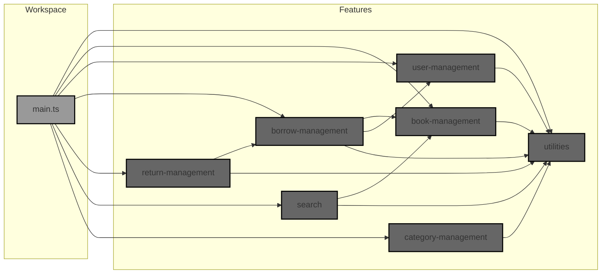

```typescript
import { checkStagedDagTests } from "jsr:@staytuned/deno-dag-test";

const config = {
  baseFolders: ["features"], // Base directories to analyze
  testTask: "test", // The test task name (e.g., "test")
};

const result = await checkStagedDagTests(config);
if (!result.ok) {
  console.error(result.error);
}
```

## Documentation: Optimize Deno Tests with `deno-dag-test`

`deno-dag-test` optimizes Deno workspace testing by executing only tests
affected by code changes. It analyzes dependencies using a Directed Acyclic
Graph (DAG), saving significant time in modular projects.

### Problem: Inefficient Full Test Runs

Large Deno workspaces can have slow test suites. Running all tests after every
change is inefficient, especially when modifications are localized to specific
modules.

### Solution: Intelligent Test Selection with `deno-dag-test`

`deno-dag-test` addresses this by:

1. **Dependency Graph (DAG):** Builds a DAG representing module dependencies by
   analyzing import statements.
2. **Change Detection:** Uses Git to identify files staged for commit.
3. **Targeted Test Execution:** Determines affected tests using the DAG and runs
   only those, reducing test time.

### How `deno-dag-test` Works - Core Steps

1. **Configuration:** Provide `baseFolders` (directories to scan) and `testTask`
   (your test task name in `deno.json`).
2. **DAG Construction:** Parses `.ts`/`.js` files in `baseFolders` to build the
   DAG. Nodes are files, edges represent imports.
3. **Staged File Detection:** Uses Git to list staged files.
4. **DAG Traversal & Test Selection:** For changed source files, traverses the
   DAG backwards to find dependent files, including relevant test files.
5. **Targeted Execution:** Runs `deno task test` for selected test files only.

### Visualizing Dependencies with the DAG

The diagram below illustrates the dependency structure of our Library Management
System workspace.



**Example using the DAG:** If you modify `book-management` (B), `deno-dag-test`
analyzes this graph. Following the arrows _to_ `book-management`, we see
`borrow-management` (Bo), `search` (S), and `main.ts` are dependent. Thus, tests
for B, Bo, and S (and potentially `main.test.ts`) will be executed. Tests for
independent features like `user-management` (U), `category-management` (C), and
`return-management` (Re) are intelligently skipped, saving significant time.

### Benefits & Real-World Example: E-commerce Platform

Consider a complex e-commerce platform with features as Deno workspace modules:

- `product-catalog`
- `order-service`
- `payment-gateway`
- `user-accounts`
- `shipping-service`
- `recommendation-engine`

These modules have intricate dependencies. For instance, `order-service` depends
on `product-catalog`, `payment-gateway`, and `shipping-service`.

**Scenario:** You fix a bug _only_ in `shipping-service`.

**Without `deno-dag-test`:** Running all tests for the entire platform would be
extremely slow.

**With `deno-dag-test`:**

- It detects changes in `shipping-service`.
- Analyzes dependencies and identifies that `order-service` depends on
  `shipping-service`, and `shipping-service` has its own tests.
- **Executes only:** Tests for `shipping-service` and `order-service`.
- **Skips:** Tests for `product-catalog`, `payment-gateway`, `user-accounts`,
  `recommendation-engine`, and other unrelated modules.

**Benefit:** Drastically reduced test execution time, faster feedback on
changes, and improved CI/CD pipeline efficiency in a large, modular project.

### Practical Usage

1. **Install:** Add `jsr:@staytuned/deno-dag-test` to `deno.json` imports.
2. **Create `dag-test.ts`:** At workspace root, with the provided configuration
   code.
3. **Configure `deno.json` Tasks:**

   ```json
   {
     "tasks": {
       "test": "deno test -A ./features",
       "dag-test": "deno run -A dag-test.ts"
     }
   }
   ```

4. **Run `deno-dag-test`:**
   - Stage changes: `git add .`.
   - Execute: `deno task dag-test`

**Important:** Stage changes before `dag-test`. Run `deno task test` initially
and after major changes.

### Conclusion

`deno-dag-test` is essential for efficient Deno workspace testing, especially in
modular and large projects. It provides significant time savings, accelerates
development, and optimizes CI/CD workflows by intelligently targeting test
execution based on code changes and dependency analysis. Integrate it to boost
your Deno development productivity. Error handling is included, with console
logging; enhance error reporting for production as needed.
